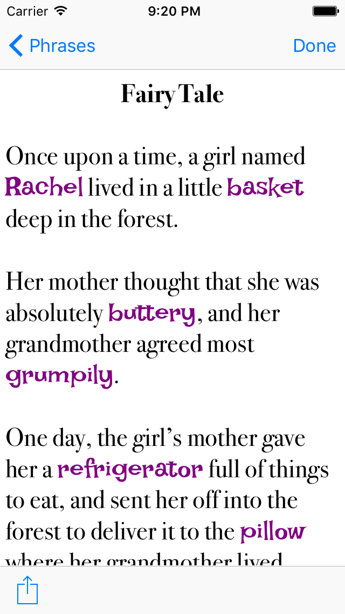

# Phrasal

Phrasal is a phrasal template word game for iOS. This means that it works something like a Mad Libs book does.

This code is the product of about a week's work.  I intended it to be an exercise in getting familiar with iOS programming using Swift 3.  It builds with Xcode 8 beta 6.

Copyright 2016, R. Matthew Emerson.  Please do not redistribute this software without my permission.
